# 📚 Digital Library Management System

A modern, microservices-based digital library application built with Flask that allows users to browse, borrow, and read technical books and documentation online.

## System Architecture

```mermaid
graph TB
    subgraph "Frontend Layer"
        WEB[🌐 Web Browser<br/>Port 5000]
    end
    
    subgraph "Gateway Layer"
        APP[🚀 Web Gateway<br/>Flask App<br/>Port 5000]
    end
    
    subgraph "Microservices Layer"
        AUTH[🔐 Auth Service<br/>Port 5002<br/>JWT & Users]
        BOOK[📖 Book Service<br/>Port 5001<br/>Book Catalog]
        BORROW[🔄 Borrow Service<br/>Port 5003<br/>Borrow System]
    end
    
    subgraph "Data Layer"
        DB[(🗄️ MySQL Database<br/>Port 3306<br/>Users, Books, Borrows)]
    end
    
    WEB --> APP
    APP --> AUTH
    APP --> BOOK
    APP --> BORROW
    AUTH --> DB
    BOOK --> DB
    BORROW --> DB
    
    style WEB fill:#4fc3f7,color:#000000,stroke:#01579b
    style APP fill:#ba68c8,color:#000000,stroke:#4a148c
    style AUTH fill:#81c784,color:#000000,stroke:#1b5e20
    style BOOK fill:#ffb74d,color:#000000,stroke:#e65100
    style BORROW fill:#f48fb1,color:#000000,stroke:#880e4f
    style DB fill:#dce775,color:#000000,stroke:#827717
```



## Data Flow Diagram


## Quick Start

### Prerequisites
- Docker
- Docker Compose

### Installation & Running

1. **Start all services**
   ```bash
   docker-compose up -d
   ```

2. **Access the application**
   - Main Application: http://localhost:5000

3. **Default Admin Account**
   - Username: `admin`
   - Password: `adminpass`

4. **Stop the application**
   ```bash
   docker-compose down
   ```

## Service Details

| Service | Port | Responsibility | Key Features |
|---------|------|----------------|-------------|
| **Web Gateway** | 5000 | Main application & UI | Template rendering, session management, service coordination |
| **Auth Service** | 5002 | Authentication | JWT tokens, user management, role-based access |
| **Book Service** | 5001 | Book catalog | CRUD operations, search, availability management |
| **Borrow Service** | 5003 | Borrowing system | Borrow/return logic, user borrowing history |
| **MySQL Database** | 3306 | Data storage | User accounts, book catalog, borrowing records |

## Database Schema


## Key Features

### User Features
- **Book Browsing** - Card-based interface with search and filtering
- **One-Click Borrowing** - Simple borrow/return system
- **Book Details** - Full information pages with official documentation links
- **Personal Library** - "My Borrowed Books" section with due dates

### Admin Features
- **Complete Book Management** - Add, edit, delete books with full CRUD
- **User Administration** - Create and manage users and roles
- **Analytics Dashboard** - System overview with statistics and borrowing history
- **Real-time Updates** - Immediate availability status changes

## Pre-loaded Content

**17 Carefully Selected Books:**

### DevOps & Cloud Native
- **The Linux Command Line** - Complete shell mastery
- **Pro Git** - Official Git documentation
- **Docker Documentation** - Containerization platform
- **Kubernetes Documentation** - Container orchestration
- **Terraform by HashiCorp** - Infrastructure as Code
- **Ansible Documentation** - Configuration management
- **Prometheus Documentation** - Monitoring system

### Cloud Platforms
- **AWS DevOps Guide** - Amazon Web Services
- **Google Cloud DevOps** - Google Cloud Platform  
- **Azure DevOps Documentation** - Microsoft Azure

### CI/CD & Tools
- **Jenkins Handbook** - Automation server
- **GitLab CI/CD Docs** - Complete DevOps platform
- **GitHub Actions Docs** - Workflow automation
- **NGINX Documentation** - Web server & load balancer

### Classic Literature
- **1984** by George Orwell
- **Pride and Prejudice** by Jane Austen
- **The Adventures of Sherlock Holmes** by Arthur Conan Doyle

## API Communication

```
Web Gateway → Microservices Communication:
• Headers: Authorization: Bearer <jwt-token>
• JSON responses for all service calls  
• Consistent error handling and user feedback
• Service discovery via Docker networking
```

## Troubleshooting

### Common Issues & Solutions

**Service Status Check:**
```bash
# Check all services
docker-compose ps

# View specific service logs
docker-compose logs app
docker-compose logs database
```

**Database Issues:**
```bash
# Restart database service
docker-compose restart database

# Check database connectivity
docker-compose exec database mysql -u app_user -p
```

**Full System Reset:**
```bash
# Complete cleanup and fresh start
docker-compose down -v
docker-compose up -d
```

**Port Conflicts:**
- Ensure ports 5000, 5001, 5002, 5003, and 3306 are available
- Check running services: `netstat -tulpn | grep :5000`

## Project Structure

```
digital-library/
├── app.py                   # Main Flask application (Gateway)
├── auth/                    # Authentication microservice
│   ├── auth_service.py      # JWT & user management
│   ├── Dockerfile           # Container configuration
│   └── requirements.txt     # Python dependencies
├── book/                    # Book management microservice  
│   ├── book_service.py      # Book CRUD operations
│   ├── Dockerfile           # Container configuration
│   └── requirements.txt     # Python dependencies
├── borrow/                  # Borrowing microservice
│   ├── borrow_service.py    # Borrow/return logic
│   ├── Dockerfile           # Container configuration
│   └── requirements.txt     # Python dependencies
├── database/                # MySQL database setup
│   ├── database.sql         # Schema & initial data
│   ├── init.sh              # Database initialization
│   ├── my.cnf               # MySQL configuration
│   └── Dockerfile           # Database container
├── templates/               # HTML templates
│   ├── base.html            # Main template
│   ├── books.html           # Book listing
│   ├── borrow.html          # Borrowed books
│   └── admin.html           # Admin dashboard
└── docker-compose.yml       # Multi-service orchestration
```

---

**Happy Reading! 📖** - Your digital library is now running with a robust microservices architecture, pre-loaded with valuable technical documentation and classic literature.
